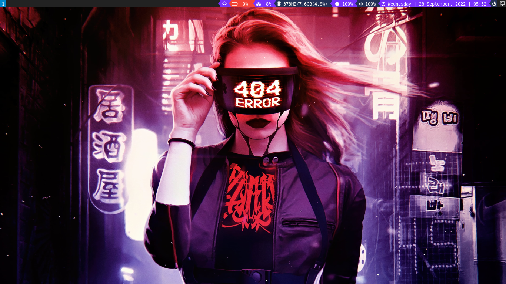

My Custom Arch Linux with i3-gaps, btrfs and zram

 

## Vanila Arch Linux Installation

 1. Dowload Arch Linux from its website <br>
		 ```https://archlinux.org/download/```
 2. Download balena etcher for making bootable USB.<br>
		 ```https://www.balena.io/etcher/```
3. Insert USB and flash the arch linux iso to the USB<br>
4. After flashing, reboot the machine and select the boot device as USB. For HP devices F9 key is used for selecting boot devices.
5. Connect to wired network if possible.
6. Boot into live iso.
7. Set your keyboard type. Search using localectl list-keymaps | grep 'type'
8. Mine is US keyboard so,<br>
	```# loadkeys us```
9. If you don't have wired connection but wireless connection. Connect to your wireless connection using iwctl<br>
	```
	# iwctl
	# station your-wireless-interface connect SSID
10. After that it will ask for wireless network password. Enter the password and check if you have the internet connection by pinging.
11. Use command lsblk to get the information of disk we currently have.
12. Use cfdisk command to make parition.
	```
	# cfdisk /dev/sda
13. Create at least minimum 300 MB partition size for efi and reset for btrfs partition.
14. Now we created parition, we need to format it. For efi partition we format it to fat32 file system<br>
	```
	# mkfs.vfat /dev/sda1
15. For btrfs partition,
	```
	# mkfs.btrfs /dev/sda2
16. Unlike ext4, in btrfs we need to create sub volumes for root, home and var directory.
17. First mount the sda2 to /mnt
	```
	# mount /dev/sda2 /mnt
18. Now create sub volumes,
	```
	# btrfs subvolume create /mnt/@
	# btrfs subvolume create /mnt/home
	# btrfs subvolume create /mnt/var
19. Now unmount the sda ,
	```
	# umount /mnt
20. Now mounting root, home and var.
	```
	# mount -o noatime, compress=zstd,ssd,discard=async,space_cache=v2,subvol=@ /dev/sda2 /mnt
21. Creating efi,home and var directory in /mnt
	```
	# mkdir -p /mnt/{boot/efi, home, var)
22. Mounting home, var and efi.
	``` 
	# mount -o noatime, compress=zstd,ssd,discard=async,space_cache=v2,subvol=@home /dev/sda2 /mnt/home
	# mount -o noatime, compress=zstd,ssd,discard=async,space_cache=v2,subvol=@var /dev/sda2 /mnt/var
	# mount /dev/sda1 /mnt/boot/efi
23. Now installing base packages
	```
	# pacstrap /mnt base linux linux-firmware git vim btrfs-progs intel-ucode
24. Now generating file system table,
	```
	# genfstab -U /mnt >> /mnt/etc/fstab
25. Now go to our installed directory or the root directory,
	```
	# arch-chroot /mnt
26. You can view the fstab using cat command.
27. Now setting time zone,
	```
	# ln -sf /usr/share/zoneinfo/Asia/Nepal /etc/localtime
28. Synchronize hardware clock to the system clock
	```
	# hwclock --systohc
29. Now editing /etc/locale.gen and uncomment your locale. My locale is en_US.UTF-8 UTF-8
30. Now generating locale by
	```# locale-gen```
31. Putting the locale into /etc/locale.conf file using echo command,
	```
	# echo "LANG=en_US.UTF-8" >> /etc/locale.conf
32. Setting hostname archNepal using echo command,
	```# echo "archNepal" >> /etc/hostname```
33. Now configuring /etc/hosts for networks
	```	  
		127.0.0.1			localhost
		::1					localhost
		127.0.1.1			archNepal.localdomain			archNepal
34. Set root password,
	```# passwd```
35. Installing base packages,
	```
	# pacman -S grub efibootmgr network-manager-applet dialog  wpa_supplicant  mtools dosfstools base-devel linux-headers bluez bluez-utils cups xdg-user-dirs pipewire alsa-utils gvfs
36. Install Bootloader. Since I am UEFI mode,
	```
	# grub-install --target=x86_64-efi efi-directory=/boot/efi --bootloader-id=GRUB
37. Create config file for GRUB
	```
	# grub-mkconfig -o /boot/grub/grub.cfg
38. Enabling Services at boot,
	```
	# systemctl enable --now NetworkManager.service
	# systemctl enable --now bluetooth
	# systemctl enable --now cups.service
	# systemctl enable fstrim.timer
39. Creating a New User and add password to it.
	```
	# useradd -m username
	# passwd username
40. Add groups to user.
	```
	# usermod -aG wheel,video,audio username
41. Add user to sudoers by command visudo. Uncomment ```wheel ALL=(ALL) ALL
42. Add btrfs modules in /etc/mkinitcpio.conf
	```
	MODULES=(btrfs)
43. Recompile the kernel.
	```
	# mkinitcpio -P
44. Now exit the arch-chroot and reboot.
45. Well arch linux is installed. Now the customization remains
## Customizing Arch Linux
1. After machine boot up, login with user and password.
2. To connect to a wireless network, use command nmtui and activate a connection. Choose a SSID and enter the password.
3. Update the system.
	```
	$ sudo pacman -Syu
4. Set NTP to true.
	```
	$ sudo timedatectl set-ntp true
5. Now installing display server, display manager and window manager.
	```
	$  sudo pacman -S xorg lightdm lightdm-slick-greeter i3 dmenu lxappearance nitrogen archlinux-wallpaper alacritty picom firefox 
6. Enable display manager.
	```
	$ sudo systemctl enable lightdm.service
7. Add replace the value of greeter-session in /etc/lightdm/lightdm.conf to lightdm-slick-greeter
8. Adding arcolinux repository, clone the arcolinux spices.
	```
	$ git clone https://github.com/arcolinux/arcolinux-spices.git
	$ sudo ./arcolinux-spices/usr/share/arcolinux-spices/scripts/[get-the-keys-and-repos.sh
9. Add chaotic repository,
	```
	$ sudo`pacman-key --recv-key FBA220DFC880C036 --keyserver keyserver.ubuntu.com
	$ sudo`pacman-key --lsign-key FBA220DFC880C036
	$ sudo`pacman -U 'https://cdn-mirror.chaotic.cx/chaotic-aur/chaotic-keyring.pkg.tar.zst' 'https://cdn-mirror.chaotic.cx/chaotic-aur/chaotic-mirrorlist.pkg.tar.zst'
10. Append chaotic mirror repo in /etc/pacman.conf
	```
	[chaotic-aur]  
	Include = /etc/pacman.d/chaotic-mirrorlist
11. Increase the maximum number of parallel downloads by uncommenting max_parallel_downloads in /etc/pacman.conf
12. Now update the system using ```$ sudo pacman -Syu```
13. Install Paru using ```$ sudo pacman -S paru```
14. Install timeshift, timeshift-autosnap zramd lightdm-settings.
	```
	$ paru -S timeshift timeshift-autosnap zramd lightdm-settings
15. Install grub-btrfs using ```$ sudo pacman -S grub-btrfs```
16. Enabling zram using 
	```$ sudo systemctl enable --now zramd```
17. Running lsblk command we can see extra swap.
18. Now reboot, we are boot into lightdm login screen.
19. Setup git.
	```
	$ git config --global user.name 'Your Username'
	$ git config --global user.email 'Your Email'
20. Setup ssh keys.
	```
	$ ssh-keygen -t ed25519 -C 'Your Email'
21. Install i3status-rust, rofi, thunar, brightnessctl and font-awesome
	```
	$ sudo pacman -S i3status-rust rofi awesome-terminal-fonts ttf-font-awesome
22. Login and open terminal. Clone this repo.
	```
	$ git clone https://github.com/ishanshre/My-Arch-Linux-Setup-and-Customization.git
23. Copy the config files to .config directory
	```
	$ cp -r My-Arch-Linux-Setup-and-Customization/config/i3 ~/.config/
	$ cp -r My-Arch-Linux-Setup-and-Customization/config/rofi ~/.config/
24.  Copy the rofi theme from the cloned directory to themes of rofi.
	```
	$ sudo cp My-Arch-Linux-Setup-and-Customization/config/rofi/catppuccin-mocha.rasi /usr/share/rofi/themes/
25. Clone rofi-power-menu from git repo
	```
	$ git clone https://github.com/jluttine/rofi-power-menu.git
26. Now copy rofi-power-menu to ```~/.locals/bin```
27. Install firewall.
	```
	$ sudo pacman -S ufw
	$ systemctl enable -now ufw
28. Tweaking performance. Chaotic Repo must be enabled
	```
	$ sudo pacman -S cfs-zen-tweaks nohang ananicy preload
	$ sudo systemctl enable --now preload
	$ sudo systemctl enable --now ananicy
	$ sudo systemctl enable --now nohang
29. Install jdk, google chrome, vscode and ntfs
	```
	$    sudo pacman -S ntfs-3g, jdk, google-chrome code
30. Install sweet-nova theme and candy icons
	```
	$ sudo pacman -S candy-icons-git sweet-cursor-theme
31. Install lts kernel
	```
	$ sudo pacman -S linux-lt linux-lts-headers linux-firmware
32. Install Docker
	```
	$ sudo pacman -S docker docker-compose docker-scan podman-compose podman
33. Install Fish Shell and Oh-My-Fish
	```
	$ sudo pacman -S fish
	$ curl https://raw.githubusercontent.com/oh-my-fish/oh-my-fish/master/bin/install | fish
	$ omf update
	$ chsh -s /usr/bin/fish $USER
34. Samples
	
